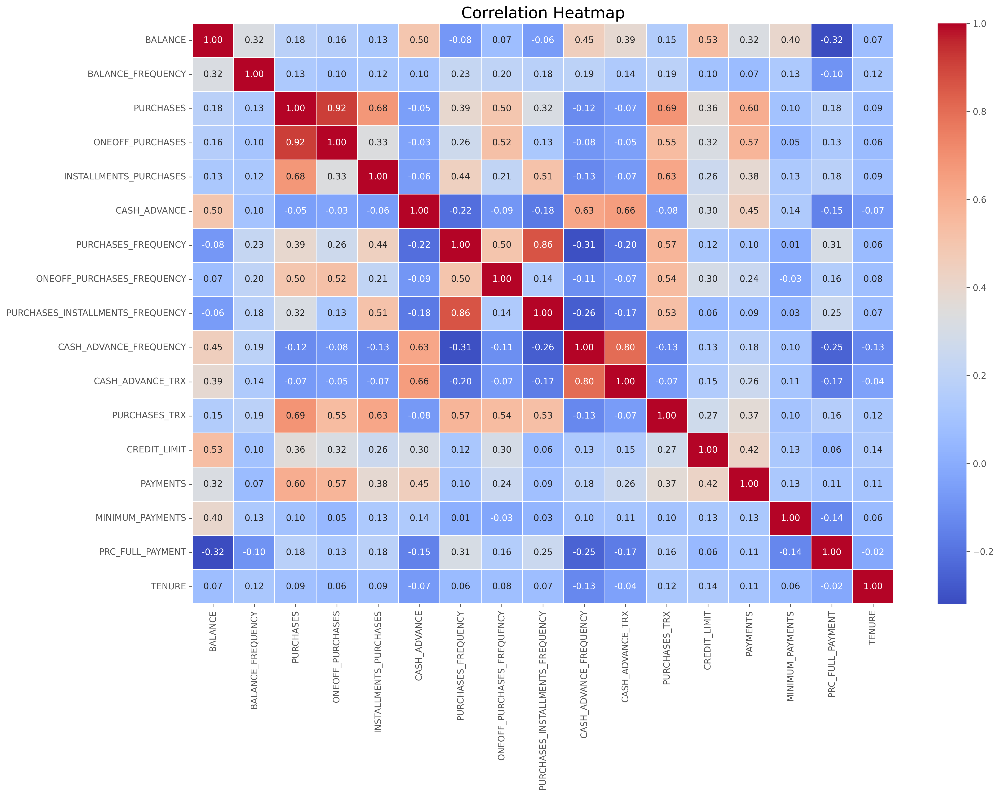
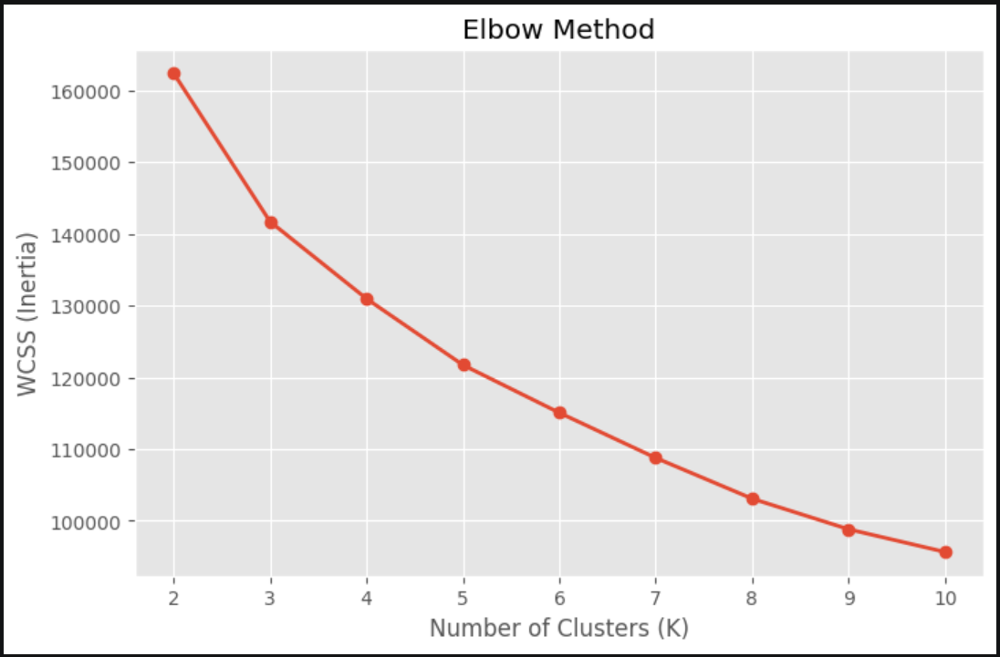
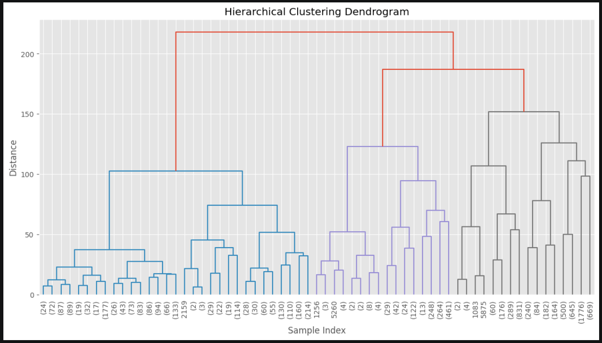
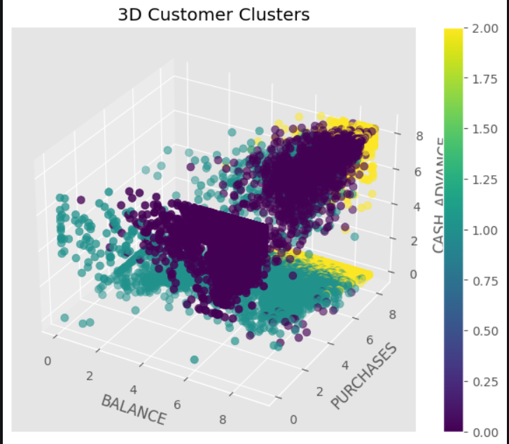
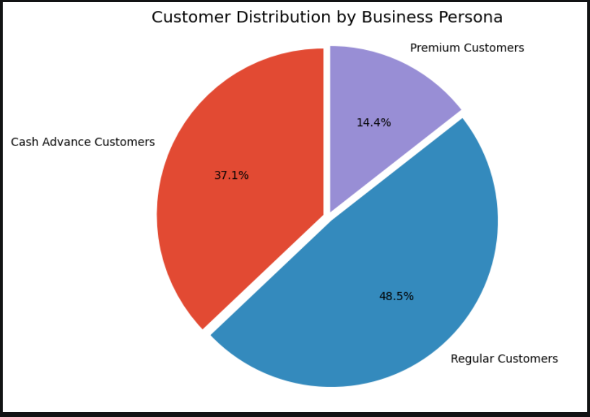
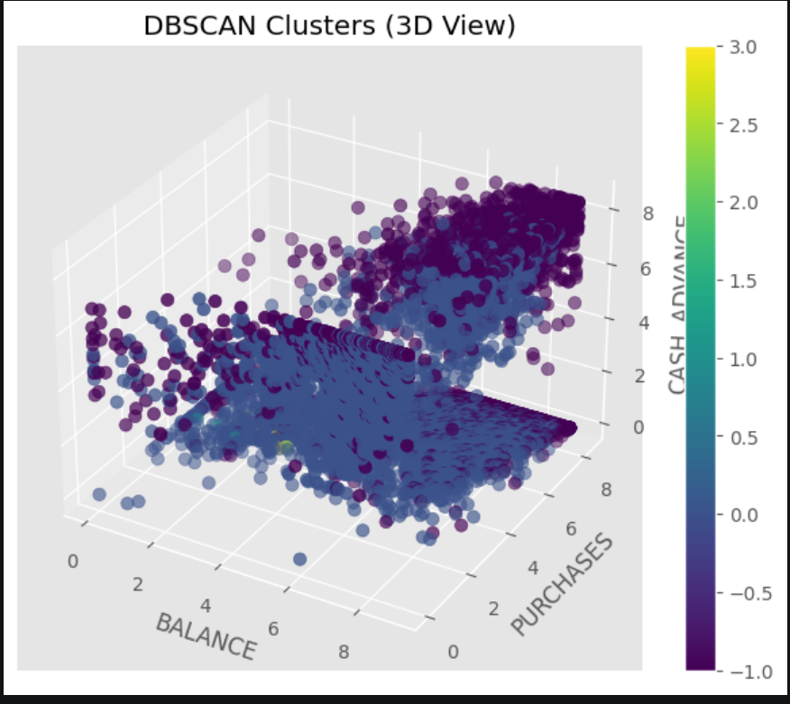
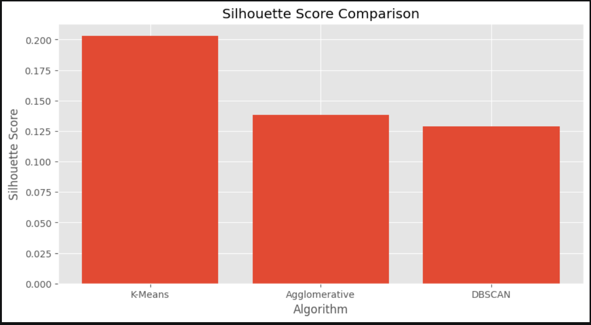

<!-- ========================================================= -->
<!--                CREDIT CARD SEGMENTATION PROJECT           -->
<!-- ========================================================= -->

<div align="center">

# 💳 Credit Card Customer Segmentation using Unsupervised Machine Learning

### 🚀 Customer Intelligence • Machine Learning • Business Analytics • Banking AI


<br>


<br>


</div>

---

# 📌 Project Overview

Customer segmentation is one of the most important applications of **Machine Learning in Banking and Financial Services**.

Banks deal with thousands of customers having different spending habits, payment behaviors, cash advance usage, and credit limits. Treating every customer the same often leads to poor marketing performance and inefficient business decisions.

This project applies **Unsupervised Machine Learning** techniques to automatically group customers with similar financial behavior into meaningful business segments.

The final solution enables banks to:

- 🎯 Personalize marketing campaigns
- 💳 Recommend suitable credit card offers
- 💰 Improve customer retention
- 📈 Increase revenue through targeted promotions
- ⚠️ Identify financially risky customers
- 🤖 Support data-driven business decision making

---

# 🎯 Project Objectives

✔ Understand customer financial behavior

✔ Discover hidden customer segments

✔ Compare multiple clustering algorithms

✔ Engineer meaningful behavioral features

✔ Evaluate clustering quality using internal metrics

✔ Generate business-friendly customer personas

✔ Build a reusable prediction pipeline

✔ Save the trained clustering model for deployment

---

# 📊 Dataset Information

| Attribute | Details |
|-----------|----------|
| Dataset | CC_GENERAL.csv |
| Domain | Banking |
| Problem Type | Unsupervised Learning |
| Algorithm Category | Clustering |
| Customers | 8,950 |
| Original Features | 17 |
| Engineered Features | 5 |
| Final Features Used | 22 |
| Missing Values | Yes |
| Duplicate Rows | Checked |
| Target Variable | None |

---

# ✨ Key Features

### 📂 Data Preprocessing

- Missing Value Imputation
- Duplicate Detection
- Feature Scaling
- Outlier Treatment
- Log Transformation

---

### 📊 Exploratory Data Analysis

- Histograms
- Boxplots
- Correlation Heatmap
- Customer-Level Analysis
- Purchase Behavior Analysis

---

### ⚙ Feature Engineering

Created new behavioral features including:

- Monthly Average Purchase
- Monthly Average Cash Advance
- Purchase Ratio
- Limit Usage
- Payment-to-Minimum Payment Ratio

---

### 🤖 Machine Learning Models

Three clustering algorithms were implemented:

| Algorithm | Purpose |
|------------|----------|
| K-Means Clustering | Primary Segmentation |
| Agglomerative Clustering | Hierarchical Customer Groups |
| DBSCAN | Density-Based Customer Discovery |

---

# 🛠 Tech Stack

| Category | Technologies |
|----------|--------------|
| Programming | Python |
| Data Analysis | Pandas, NumPy |
| Visualization | Matplotlib, Seaborn |
| Machine Learning | Scikit-Learn |
| Statistics | SciPy |
| Model Saving | Joblib |
| Notebook | Jupyter Notebook |
| Version Control | Git & GitHub |

---

# 📈 Project Workflow

```text
CC_GENERAL.csv
        │
        ▼
Data Cleaning
        │
        ▼
Exploratory Data Analysis
        │
        ▼
Feature Engineering
        │
        ▼
Outlier Treatment
        │
        ▼
Log Transformation
        │
        ▼
Feature Scaling
        │
        ▼
K-Means
Agglomerative
DBSCAN
        │
        ▼
Algorithm Comparison
        │
        ▼
Business Personas
        │
        ▼
Prediction Pipeline
        │
        ▼
Deployment Ready Model
```

---

# 📚 Table of Contents

- Project Overview
- Dataset Information
- Features
- Technology Stack
- Workflow
- Folder Structure
- Installation
- Exploratory Data Analysis
- Feature Engineering
- K-Means Clustering
- Agglomerative Clustering
- DBSCAN Clustering
- Model Evaluation
- Business Personas
- Deployment
- Results
- Future Improvements
- Author

---

# ▶️ Running the Project

Launch Jupyter Notebook

```bash
jupyter notebook
```

Open

```text
CreditCardSegmentation_UnsupervisedLearning.ipynb
```

Run all notebook cells from top to bottom.

---

# 📦 Python Libraries Used

```python
import numpy as np
import pandas as pd

import matplotlib.pyplot as plt
import seaborn as sns

from sklearn.preprocessing import StandardScaler

from sklearn.cluster import KMeans
from sklearn.cluster import AgglomerativeClustering
from sklearn.cluster import DBSCAN

from sklearn.metrics import silhouette_score
from sklearn.metrics import davies_bouldin_score
from sklearn.metrics import calinski_harabasz_score

from scipy.cluster.hierarchy import linkage
from scipy.cluster.hierarchy import dendrogram

import joblib
```

---

# 🔄 Complete Machine Learning Pipeline

```text
Load Dataset
      │
      ▼
Understand Data
      │
      ▼
Check Missing Values
      │
      ▼
Handle Missing Values
      │
      ▼
Duplicate Check
      │
      ▼
Feature Engineering
      │
      ▼
Outlier Treatment
      │
      ▼
Log Transformation
      │
      ▼
Feature Scaling
      │
      ▼
K-Means Clustering
      │
      ▼
Hierarchical Clustering
      │
      ▼
DBSCAN Clustering
      │
      ▼
Model Evaluation
      │
      ▼
Business Interpretation
      │
      ▼
Model Saving
      │
      ▼
Prediction Pipeline
```

---

# 🧹 Data Preprocessing

The dataset required several preprocessing steps before clustering.

### ✔ Removed Unnecessary Columns

- Customer ID

---

### ✔ Missing Value Treatment

The following columns contained missing values:

| Feature | Strategy |
|----------|-----------|
| CREDIT_LIMIT | Median Imputation |
| MINIMUM_PAYMENTS | Median Imputation |

Median was selected because these financial variables were positively skewed.

---

### ✔ Duplicate Records

Duplicate observations were checked and removed if present.

---

### ✔ Feature Engineering

Several behavioral features were created.

| Feature | Description |
|----------|-------------|
| Purchase Ratio | Purchase behavior relative to balance |
| Monthly Average Purchase | Average monthly spending |
| Monthly Average Cash Advance | Monthly cash advance usage |
| Limit Usage | Credit utilization ratio |
| Payment-to-Minimum Payment Ratio | Payment discipline indicator |

These engineered features improved clustering quality by capturing customer behavior more effectively.

---

# 📊 Exploratory Data Analysis

Several visualization techniques were used to understand customer behavior.

### Distribution Analysis

✔ Histograms

✔ Density Plots

✔ Log Transformed Distributions

---

### Outlier Analysis

✔ Boxplots

✔ IQR Method

✔ Winsorization

---

### Relationship Analysis

✔ Correlation Heatmap

✔ Pairwise Feature Analysis

✔ Feature Importance Observation

---

# 📈 Data Transformation

Because most monetary variables were highly right-skewed, a **logarithmic transformation (`log1p`)** was applied.

Benefits:

- Reduced skewness
- Improved cluster separation
- Reduced effect of extreme values
- Enhanced distance-based clustering performance

---

# ⚖️ Feature Scaling

StandardScaler was applied before clustering.

Formula:

\[
z = \frac{x-\mu}{\sigma}
\]

Why scaling?

- Equal importance for every feature
- Better Euclidean distance calculation
- Faster convergence
- Improved clustering accuracy

---

# 🤖 Clustering Algorithms

Three different clustering algorithms were implemented.

## ① K-Means Clustering

Purpose:

- Fast customer segmentation
- Centroid-based clustering
- Easy interpretation

Hyperparameter

```python
n_clusters = 3
```

---

## ② Agglomerative Hierarchical Clustering

Purpose:

- Hierarchical customer grouping
- Dendrogram visualization
- Ward linkage

Hyperparameter

```python
linkage = "ward"
```

---

## ③ DBSCAN

Purpose

- Density-based clustering
- Outlier detection
- Automatic discovery of dense regions

Hyperparameters

```python
eps = 1.5

min_samples = 10
```

---

# 💾 Model Persistence

The trained K-Means model and StandardScaler were saved using Joblib.

```python
joblib.dump(kmeans, "cc_segmentation_model.pkl")

joblib.dump(scaler, "cc_scaler.pkl")
```

These files enable prediction on new customer data without retraining the model.

---

# 📌 Summary of Implementation

✔ Data Cleaning

✔ Feature Engineering

✔ Exploratory Data Analysis

✔ Outlier Handling

✔ Feature Scaling

✔ K-Means Clustering

✔ Agglomerative Clustering

✔ DBSCAN Clustering

✔ Model Evaluation

✔ Business Interpretation

✔ Prediction Pipeline

✔ Model Saving

---

# 📊 Model Performance & Results

After preprocessing, feature engineering, and scaling, three clustering algorithms were trained and evaluated to identify the best customer segmentation model.

---

# 🏆 Clustering Algorithm Comparison

| Algorithm | No. of Clusters | Silhouette Score ↑ | Davies-Bouldin ↓ | Calinski-Harabasz ↑ | Status |
|-----------|:---------------:|:------------------:|:----------------:|:-------------------:|:------:|
| **K-Means** | **3** | **0.2030** | **1.6843** | **1741.34** | 🥇 Best |
| Agglomerative | 3 | 0.1382 | 1.9480 | 1186.20 | 🥈 Good |
| DBSCAN | 4 | 0.1288 | 1.1108 | 22.36 | 🥉 Fair |

---

# 🥇 Best Performing Model

<div align="center">

| Model | K-Means Clustering |
|--------|-------------------|
| Number of Clusters | **3** |
| Silhouette Score | **0.2030** |
| Best Business Choice | ✅ Yes |
| Model Saved | ✅ Yes |
| Deployment Ready | ✅ Yes |

</div>

---

# 📈 K-Means Cluster Profile

| Cluster | Business Persona | Characteristics |
|----------|-----------------|-----------------|
| **Cluster 0** | 👑 Premium Customers | High credit limit, high balance, frequent purchases, valuable customers |
| **Cluster 1** | 💳 Regular Customers | Moderate spending, regular transactions, stable payment history |
| **Cluster 2** | 💰 Cash Advance Customers | Frequent cash advances, higher financial dependency, lower purchase activity |

---

# 👥 Customer Personas

## 👑 Premium Customers

### Characteristics

- High Balance
- High Credit Limit
- Large Purchases
- High Monthly Spending
- Excellent Payment Behaviour

### Business Opportunities

✅ Premium Credit Cards

✅ Airport Lounge Access

✅ Investment Products

✅ Wealth Management

✅ Exclusive Cashback Offers

---

## 💳 Regular Customers

### Characteristics

- Average Purchases
- Moderate Credit Usage
- Stable Payments
- Consistent Transactions

### Business Opportunities

✅ Reward Programs

✅ Shopping Discounts

✅ EMI Offers

✅ Credit Limit Upgrade

---

## 💰 Cash Advance Customers

### Characteristics

- High Cash Advance Usage
- Lower Purchase Frequency
- High Outstanding Balance
- Higher Credit Dependency

### Business Opportunities

✅ Debt Management Plans

✅ EMI Conversion

✅ Financial Advisory

✅ Lower Interest Campaigns

---

# 📉 Model Evaluation Metrics

## 📌 Silhouette Score

- Measures cluster separation.
- Higher values indicate better clustering.

**Best Model:** K-Means (0.2030)

---

## 📌 Davies-Bouldin Index

- Measures cluster similarity.
- Lower values indicate better clustering.

**Best Value:** DBSCAN (1.1108)

---

## 📌 Calinski-Harabasz Index

- Measures cluster compactness.
- Higher values indicate stronger clustering.

**Best Model:** K-Means (1741.34)

---

# 📊 Business Impact

The developed segmentation model enables financial institutions to:

- 🎯 Personalize marketing campaigns
- 💳 Recommend suitable credit cards
- 💰 Improve customer retention
- 📈 Increase cross-selling opportunities
- ⚠️ Detect financially risky customers
- 📊 Understand customer behaviour
- 🤖 Support AI-driven banking decisions

---

# 📷 Project Visualizations

The following visualizations demonstrate the complete workflow of customer segmentation using multiple clustering algorithms.

---

# 📊 Correlation Heatmap

This heatmap illustrates the correlation between all numerical features, helping identify strong positive and negative relationships before clustering.

<p align="center">
  
</p>

---

# 📈 Elbow Method

The Elbow Method was used to determine the optimal number of clusters for the K-Means algorithm. Based on the graph, **K = 3** was selected as the optimal value.

<p align="center">
  
</p>

---

# 🌳 Hierarchical Clustering Dendrogram

The dendrogram illustrates the hierarchical relationship among customers. By analyzing the largest vertical distance, the optimal number of clusters can be determined.

<p align="center">
  
</p>

---

# 🌲 Agglomerative Clustering

Visualization of customer groups generated using the Agglomerative Hierarchical Clustering algorithm.

<p align="center">
  
</p>

---

# 🎯 K-Means Cluster Visualization

Principal Component Analysis (PCA) was used to reduce the feature dimensions for visualization. Each color represents a unique customer segment identified by the K-Means algorithm.

<p align="center">
  
</p>

---

# 🥧 Customer Distribution Across K-Means Clusters

This chart shows the percentage distribution of customers across the three identified customer segments.

<p align="center">
  
</p>

---

# 🌌 DBSCAN Cluster Visualization

DBSCAN groups customers based on density and automatically identifies noise points (outliers) that do not belong to any cluster.

<p align="center">
  
</p>

---

# 🏆 Clustering Algorithm Performance Comparison

Comparison of the three clustering algorithms using evaluation metrics such as Silhouette Score, Davies-Bouldin Index, and Calinski-Harabasz Index.

<p align="center">
  
</p>

---

# 📌 Visualization Summary

| Visualization | Purpose |
|--------------|---------|
| 📊 Correlation Heatmap | Analyze feature relationships |
| 📈 Elbow Curve | Determine optimal K value |
| 🌳 Dendrogram | Identify hierarchical clusters |
| 🌲 Agglomerative Clustering | Visualize hierarchical segmentation |
| 🎯 K-Means Clusters | Display customer segments |
| 🥧 Customer Distribution | Show cluster proportions |
| 🌌 DBSCAN Clusters | Density-based segmentation with noise detection |
| 🏆 Algorithm Comparison | Compare clustering model performance |

---

# 📈 End-to-End Workflow

```text
Credit Card Dataset
          │
          ▼
 Data Cleaning
          │
          ▼
 Feature Engineering
          │
          ▼
 Outlier Treatment
          │
          ▼
 Log Transformation
          │
          ▼
 Feature Scaling
          │
          ▼
 ┌──────────────┐
 │  K-Means     │
 └──────────────┘
          │
 ┌──────────────┐
 │Agglomerative │
 └──────────────┘
          │
 ┌──────────────┐
 │   DBSCAN     │
 └──────────────┘
          │
          ▼
 Evaluation Metrics
          │
          ▼
 Business Personas
          │
          ▼
 Recommendation
          │
          ▼
 Deployment Pipeline
```

---

# 💼 Business Recommendation

Based on all clustering evaluation metrics and business interpretability, **K-Means Clustering** is recommended for deployment.

### Why?

- ✅ Highest Silhouette Score
- ✅ Highest Calinski-Harabasz Index
- ✅ Stable Across Multiple Runs
- ✅ Easy to Interpret
- ✅ Computationally Efficient
- ✅ Suitable for Large Banking Datasets

---

# 📌 Key Achievements

✅ Cleaned 8,950 customer records

✅ Engineered behavioural features

✅ Compared 3 clustering algorithms

✅ Identified 3 customer personas

✅ Built deployment-ready prediction pipeline

✅ Saved trained model using Joblib

✅ Generated business recommendations

✅ Created an end-to-end unsupervised learning project

---

# 🚀 Deployment

The trained K-Means clustering model and preprocessing pipeline are saved using **Joblib**, making the solution deployment-ready.

### Saved Files

| File | Purpose |
|------|---------|
| `cc_scaler.pkl` | StandardScaler for preprocessing new customer data |
| `cc_segmentation_model.pkl` | Trained K-Means clustering model |

---

# 🔮 Prediction Pipeline

The deployment pipeline follows these steps:

```text
New Customer Data
        │
        ▼
Feature Validation
        │
        ▼
StandardScaler
        │
        ▼
K-Means Model
        │
        ▼
Cluster Prediction
        │
        ▼
Business Persona
        │
        ▼
Business Recommendation
```

---

# 📦 Output Example

| Customer | Predicted Cluster | Business Persona |
|-----------|------------------:|------------------|
| Customer 1 | 0 | 👑 Premium Customers |
| Customer 2 | 1 | 💳 Regular Customers |
| Customer 3 | 2 | 💰 Cash Advance Customers |
| Customer 4 | 1 | 💳 Regular Customers |
| Customer 5 | 0 | 👑 Premium Customers |

---

# 📊 Business Value

This project enables banks and financial institutions to:

- 🎯 Build personalized marketing campaigns
- 💳 Recommend suitable credit card products
- 💰 Increase customer retention
- 📈 Improve cross-selling opportunities
- 📉 Reduce customer churn
- ⚠️ Identify high-risk customer behavior
- 🤖 Support AI-driven decision making

---

# 🔮 Future Improvements

The current project can be extended with:

- 📱 Real-time customer segmentation API using FastAPI
- ☁️ Cloud deployment (Render, Railway, Azure, AWS)
- 📊 Interactive dashboard using Streamlit or Power BI
- 🤖 Automatic model retraining
- 📈 Customer Lifetime Value (CLV) prediction
- 💳 Credit default risk prediction
- 📌 Explainable AI (SHAP/LIME)
- 📉 Customer churn prediction
- 🧠 Deep learning-based customer representation
- 📡 Real-time transaction monitoring

---

# 🏅 Skills Demonstrated

### Data Analysis

- Data Cleaning
- Missing Value Treatment
- Outlier Detection
- Feature Engineering
- Exploratory Data Analysis

### Machine Learning

- Unsupervised Learning
- K-Means Clustering
- Agglomerative Clustering
- DBSCAN
- Cluster Evaluation
- Model Comparison

### Python Libraries

- Pandas
- NumPy
- Scikit-Learn
- SciPy
- Matplotlib
- Seaborn
- Joblib

### Business Analytics

- Customer Segmentation
- Banking Analytics
- Business Personas
- Recommendation Strategy

---

# 👨‍💻 Author

<div align="center">

## Tushar Vala

### 💼 Data Analyst | AI & Machine Learning Enthusiast

Passionate about transforming raw data into meaningful business insights using Data Analytics, Machine Learning, and Artificial Intelligence.

</div>

---


<div align="center">

## ⭐ Thank You for Visiting ⭐

### "Turning Data into Actionable Business Intelligence through AI & Machine Learning."


</div>
